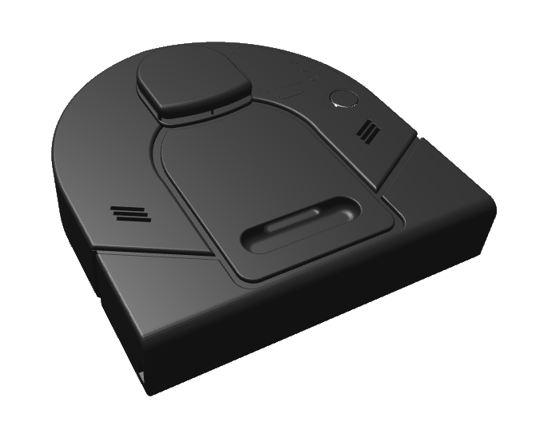
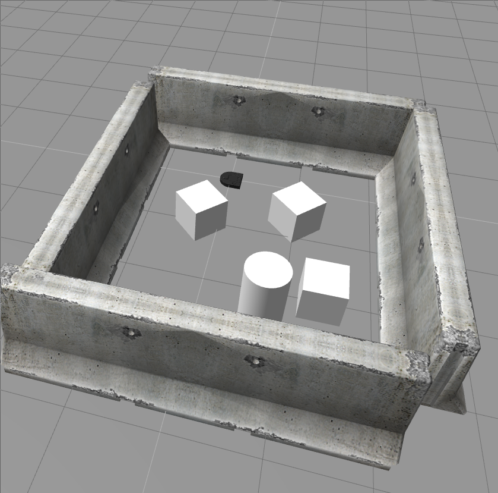
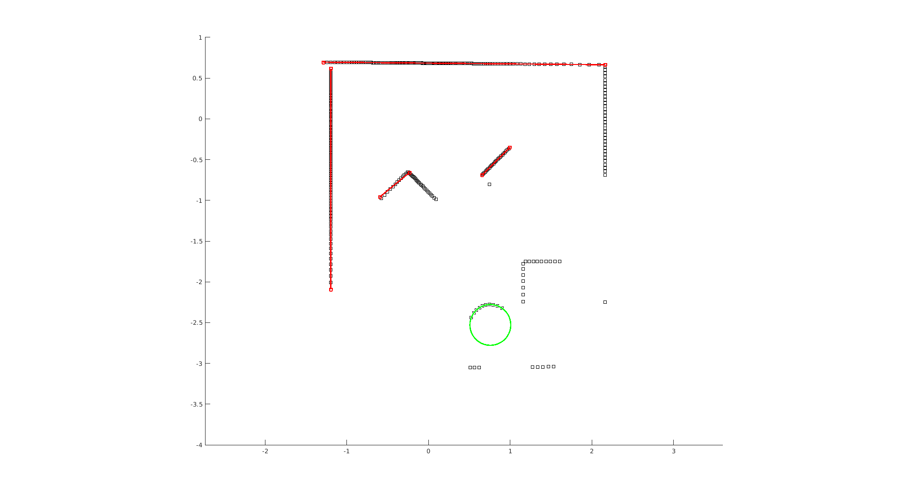
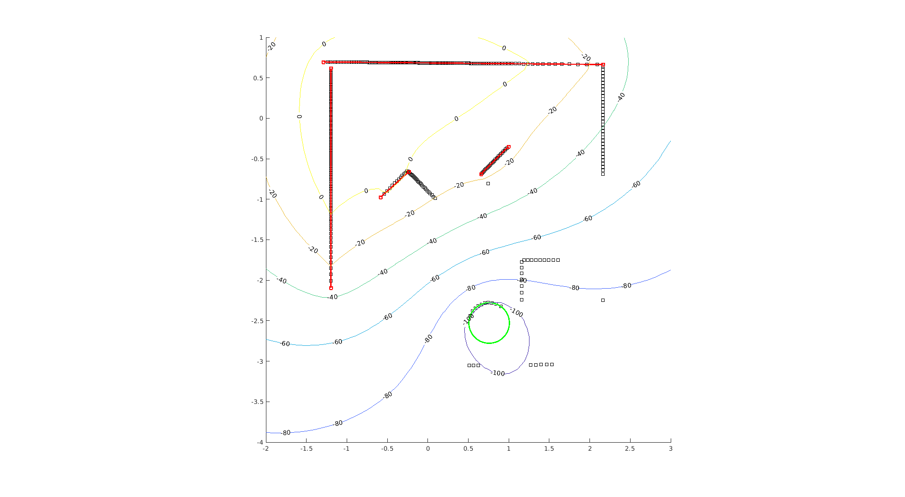
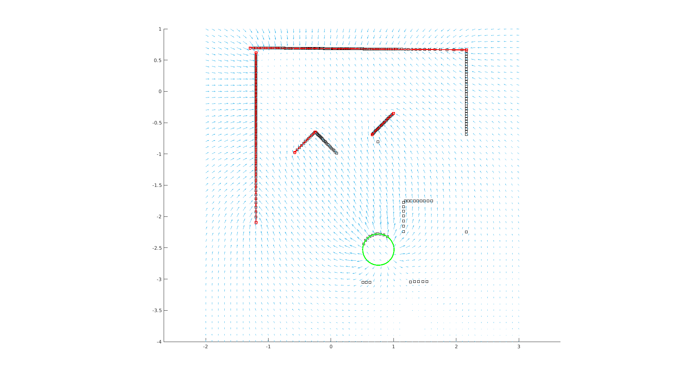
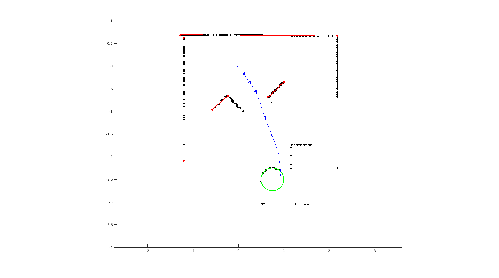

# QEA presents NEATO: The Gauntlet

Jack Greenberg

    
Table of Contents

    <ul>
        <li><a href="#the-hero">The Hero</a></li>
        <ul>
            <li><a href="#the-challenge">The Challenge</a></li>
            <li><a href="#the-world">The World</a></li>
        </ul>
        <li><a href="#some-graphs">Some Graphs</a></li>
        <li><a href="#some-code">Some Code</a></li>
        <ul>
            <li><a href="#ransac">RANSAC</a></li>
            <li><a href="#gradient-descent">Gradient Descent</a></li>
        </ul>
    </ul>

## The Challenge

The objective of this task is to get the NEATO to navigate a playpen until it reaches the "Barrel of Benevolence" (a cylinder), while avoiding boxes.

### The Hero

The NEATO is a differential drive, two-wheeled robot that was simulated using a series group of docker containers, and interfaced with using the ROS (Robotic Operating System) toolbox in MATLAB.

### The World

## Some Graphs

Map of the Gauntlet as seen by the NEATO's LIDAR scanner, with features detected by the RANSAC algorithm.

Gauntlet map with contour lines shown.

Gauntlet map with vector field shown.

Planned path of the NEATO at the beginning. This will update as the NEATO progesses forward and generates new LIDAR scans.

## The Code

### RANSAC

Coming soon...

### Gradient Descent

See above...