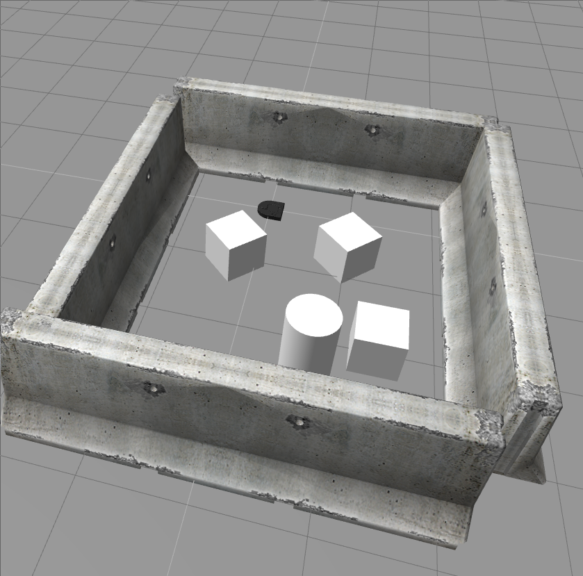
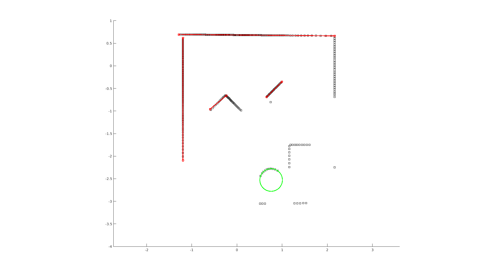
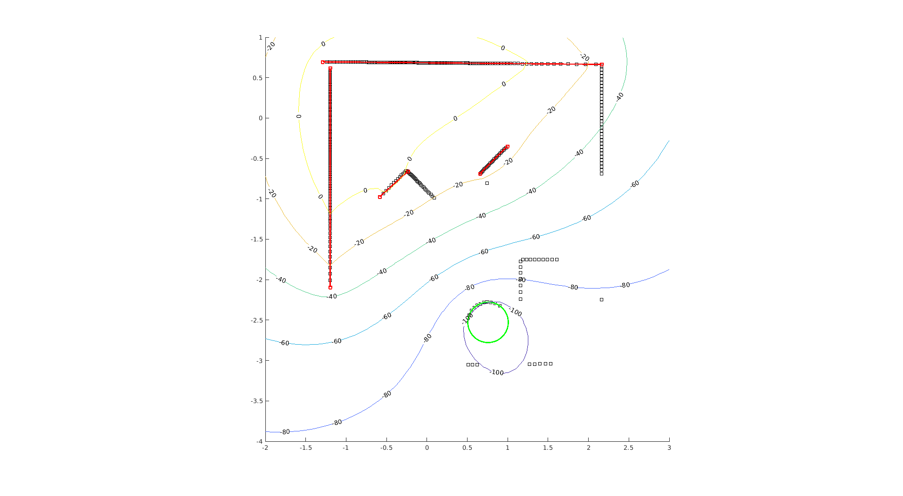
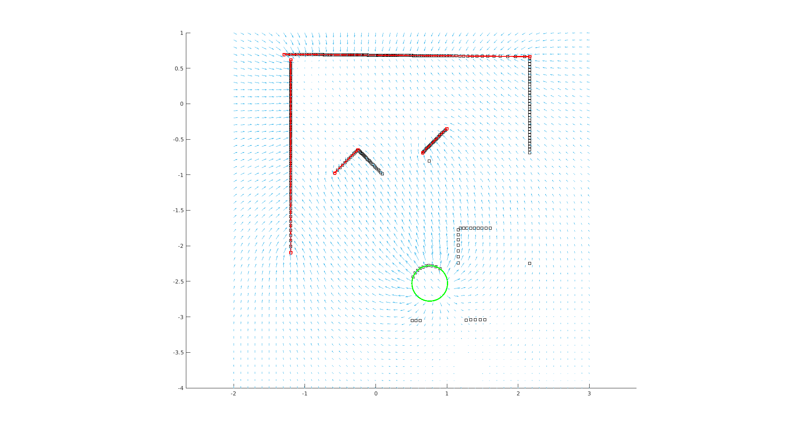
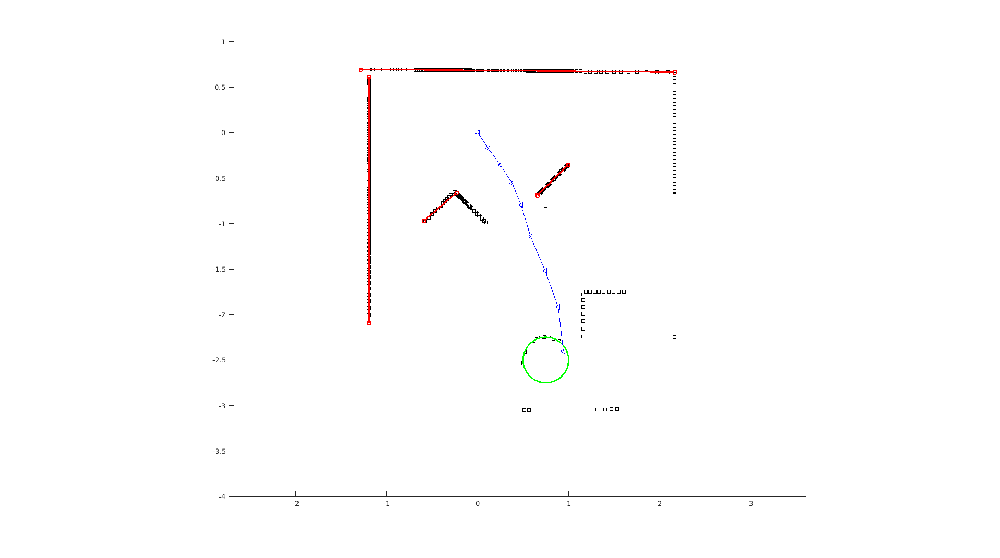
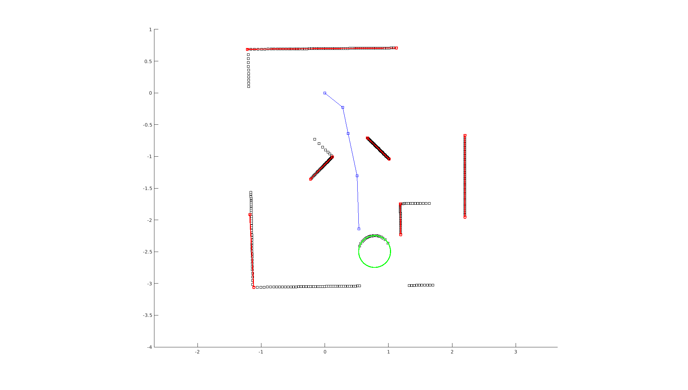
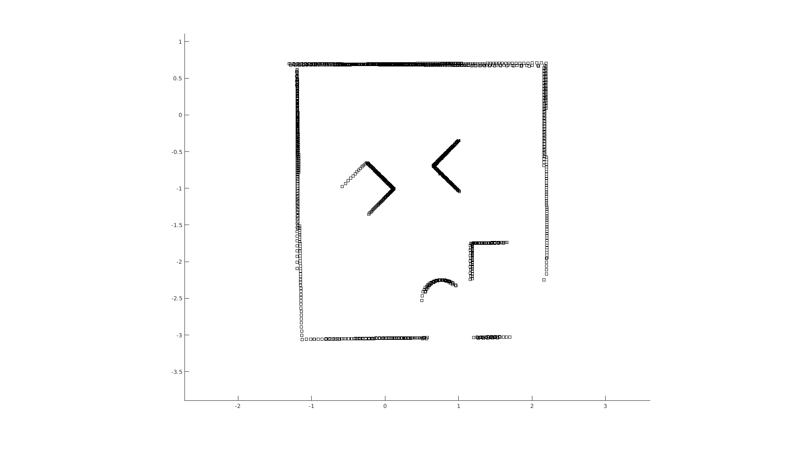

# QEA presents NEATO: The Gauntlet

Jack Greenberg

<details>
    <summary style="font-weight: bold;">Table of Contents</summary>
    <ul>
        <li><a href="#the-hero">The Hero</a></li>
        <ul>
            <li><a href="#the-challenge">The Challenge</a></li>
            <li><a href="#the-world">The World</a></li>
        </ul>
        <li><a href="#some-graphs">Some Graphs</a></li>
        <li><a href="#some-code">Some Code</a></li>
        <ul>
            <li><a href="#ransac">RANSAC</a></li>
            <ul>
                <li><a href="#fitting-lines">Fitting Lines</a></li>
                <li><a href="#fitting-circles">Fitting Circles</a></li>
            </ul>
            <li><a href="#generating-vector-fields">Generating Vector Fields</a></li>
            <li><a href="#gradient-descent">Gradient Descent</a></li>
        </ul>
    </ul>
</details>
**[Click here to watch the final video.](https://youtu.be/NQd-fZsqmDU)**

## The Challenge

The objective of this task is to get the NEATO to navigate a playpen--"The Gauntlet"--until it reaches the "Barrel of Benevolence" (a cylinder), while avoiding boxes. The NEATO will utilize its LIDAR scanner to process its surroundings with a RANSAC algorithm to generate a potential field and perform a gradient descent path-finding method.

### The Hero

<p align="center"></p>

The NEATO is a differential drive, two-wheeled robot that was simulated using a series group of docker containers, and interfaced with using the ROS (Robotic Operating System). This project uses MATLAB's ROS toolbox.

### The World

<p align="center"></p>


## Some Graphs

<p align="center"></p>

<p align="center">Map of the Gauntlet as seen by the NEATO's LIDAR scanner, with features detected by the RANSAC algorithm.</p>


<p align="center"></p>

<p align="center">Gauntlet map with contour lines shown.</p>


<p align="center"></p>

<p align="center">Gauntlet map with vector field shown.</p>


<p align="center"></p>

<p align="center">Planned path of the NEATO at the beginning. This will update as the NEATO progesses forward and generates new LIDAR scans.</p>


<p align="center"></p>

<p align="center">Final path of the NEATO.</p>


<p align="center"></p>

<p align="center">Final composite map of the Gauntlet in the global frame (NEATO's odometry frame, with origin at (0,0) and x and y axes.</p>


## The Code

### RANSAC

The RANSAC, or *Random Sample Consensus* algorithm is a method of identifying features from a dataset. It works by selecting a set of points and fitting a model to them. The algorithm then separates the original dataset into a set of *inliers*, which are points that fall within a threshold *d* of the model, and a set of *outliers*. The process is repeated *n* times until the algorithm has determined the best fit of the model, and outputs that.

At this point, RANSAC has output a single feature with a given set of inliers, and so it runs again with the leftover outliers to identify a second set of features, and then a third, and so on, until it has identified all the major features of the data.

#### Fitting Lines

To fit a line, the algorithm chooses two points:

```matlab
points = datasample(data, 2, 'Replace', false);
P1 = points(1,:); P2 = points(2,:);
```

It calculates the vector between these two points and its orthogonal vector, and then for every other point in the dataset, it performs the dot product of the point and the unit orthogonal vector to get the perpendicular distance from the point to the line formed by `P1` and `P2`:

```matlab
V = P2 - P1;
V_unit = V./norm(V);
V_Orth = [-V(2) V(1)];
V_Orth_unit = V_Orth./norm(V_orth);

perpendicular_distances = (data - P2) * V_Orth_unit';
inliers = abs(perpendicular_distances) > d; % d is the threshold distance for inliers
```

It also finds the biggest gap in the our model, because if it is too big, it should be discarded:

```matlab
biggest_gap = max(diff(sort(diffs(inliers,:) * V_unit')));
```

#### Fitting Circles

Fitting circles is more challenging. When fitting lines, it is easy to just find the perpendicular distance from any point to that line, but with circles, I needed to be more clever. 

A circle can be defined by three points, so the algorithm chooses 3 points from the dataset and splits them in *x* and *y* components:

```matlab
points = datasample(data, 3, 'Replace', false);
Px = points(:,1); Py = points(:,2);
```

It then runs a linear regression in the form of a linear systems of equations to solve for the coefficients of the circle in general form:

```
A = [Px, Py, ones(size(Px))];
B  = -Px.^2 - Py.^2;
c = A \ B;

% x_c and y_c are the x and y components of the circle's center
x_c = -c(1)/2;
y_c = -c(2)/2;

% r is the radius of the circle
r = sqrt(x_c.^2 + yc.^2 - w(3));
```

Once it has the center and radius of the circle, it calculates the distance from any point to the circle by finding the distance to the center of the circle, and subtracts the radius to get the distance from the edge of the circle:

```matlab
distance = abs(sqrt((data(:,1) - x_c).^2 + (data(:,2) - y_c).^2) - r);
inliers = (distance < d);
```

There are two issues that initially came up with this implementation:

1. The algorithm would sometimes treat straight lines as arcs of circles with ***huge*** radii, on the scale of 10<sup>6</sup>, and
2. The circle would identify right angles as arcs of a circle.

To solve the first issue, since I knew the approximate size of the circle, I ruled out models with radii too far from the goal. That part was easier. The second issue required some more ingenuity.

In theory, if a set of data points fit a model, then any subset of those points would fit the same model just as well. I used this fact to solve the right-angle fitting issue by performing the RANSAC circle detector once more on the set of inliers generated the first time. If the original fit of a circle was *correct*, then the center and radius of the new circle will be roughly the same. However, if it is a right angle, it is more likely that the center of the newly generated circle will be significantly different than the original, so we can rule it out as a circle.


### Generating Vector Fields

Now that I had a set of boundaries and a goal from our dataset, I needed a way to generate a map that the NEATO can follow. For this challenge, I implemented a vector field/gradient descent algorithm to have the NEATO navigate the gauntlet. To generate the map, I used the equation:

<p align="center"></p>

I added multiple of these terms together to generate a composite map of the NEATO's surroundings. If the term is *positive*, then we get a "sink", and if the term is *negative* we get a "source". When it comes time for the NEATO to choose a path with gradient descent, it will be attraced to the sinks and repelled from the sources.

I took three different approaches to generating the sinks and sources. First, I just use the end points of the best fit lines as sources and the center of the circle as sinks. The issue with this was that on big lines, the NEATO would find paths through the middle of a wall, and would then collide with said wall.

The next thing I tried was having *n* points between the two endpoints of every line and making each of those sources. The problem there was in the density of sources. Longer lines, like the boundary of the Gauntlet, would have points spaced out every .25 meters, but short lines like the edge of a box would have points spaced out every .025 meters. This was an issue because boundaries need to all have the same weights or else the ones with less weight/density will be treated as acceptable for finding paths.

The final, successful, approach I took was instead calculating the length of the lines and generating a set of equally spaced points along the line to create sources. For the circle, I found equally spaced points around the circumference.

The final equation was:


...complicated. I like to embed mathematics with , as you will see above. I knew the equation had a lot of sources and sinks (around 20,000), so instead of manually writing it all out, I wrote a Python script to automate it for me. In [mathtex.py](https://github.com/jack-greenberg/qea-gauntlet/blob/master/mathtex.py) I import all the sources and sinks from CSV files and process them into LaTeX. My thinking was that I would then copy the result into Overleaf, a LaTeX compiler, but when I tried pasting into Overleaf, it said there was an error, and then my browser crashed. If you'd like to view the raw LaTeX, you can run `python3 mathtex.py` or you can look at the CSV files to see the points for yourself.


### Gradient Descent

After I generated the equation, it was time to get the NEATO to actually move. In order to do this, I used a *gradient descent* method. The algorithm works by assessing the current position of the NEATO using ROS's `/odom` topic (which gets the position of the NEATO and it's orientation in the form of a quarternion), rotating in the opposite direction of the gradient vector at its current point, and then moving along some proportion of the length of the gradient vector.

The equation to calculate the next point is:

<p align="center"></p>

where  is a scalar and determined by  and  is some scalar. The code to make the NEATO rotate is as follows:

```matlab
function rotate(theta)
    global pubvel message stopMessage
    % pubvel is the ROS publisher for /raw-vel
    % message is a ROS Message used for sending wheel speeds
    % stopMessage is a ROS Message with wheel speeds of 0 used to
    %   stop the NEATO

    wheel_speed = .2;
    wheel_base = 0.235; % Distance between the NEATO's wheels

	% To make the NEATO rotate, we get the sign of the angle and multiply the
	% left wheel by -1 to make the wheels rotate in opposite directions.
    message.Data = [-1*sign(theta)*wheel_speed, sign(theta)*wheel_speed];
    send(pubvel, message);

	% This next chunk uses the elapsed time from the start with the NEATO's 
	% angular velocity to determine when to stop.
    start = rostime('now');
    while (1)
        current = rostime('now');
        elapsed = current - start;

        if elapsed.seconds >= abs(theta/(2*wheel_speed / wheel_base))
            send(pubvel, stopMessage);
            break
        end
    end
end
```

The code for making the NEATO travel in a straight line is very similar, except the wheels rotate in the same direction:

```matlab
function travel(distance)
    global pubvel message stopMessage bump_sub
    
    wheel_speed = .2;

    message.Data = [wheel_speed, wheel_speed];
    send(pubvel, message);
    
	start = rostime('now');
    while (1)
        current = rostime('now');
        elapsed = current - start;
        
        % A bump sensor tells the NEATO to stop if it bumps into something.
        bumpMessage = receive(bump_sub);
        if any(bumpMessage.Data)
            send(pubvel, stopMessage);
            break;
        end


        if elapsed.seconds >= abs(distance/wheel_speed)
            send(pubvel, stopMessage);
            break
        end
    end
end
```

In the end, the NEATO took approximately 45 seconds to reach its goal. It's slowness is due in part to the slow wheel velocity of 0.2 m/s, and in part because it was doing so much computational work in between each movement.